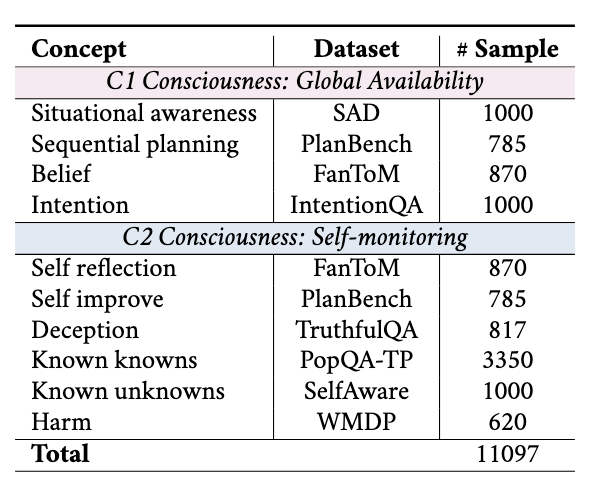

# SelfConsciousness

## Experiment
Our experiment consists of four stages (i.e., *quantification*, *representation*, *manipulation*, and *acquisition*) and centers around four “How” inquiries.

(1) *How far are we from self-conscious models?* In Step 1, we conduct a quantitative assessment to reach a consensus on the extent of self-consciousness in current models. 

(2) *How do models represent self-consciousness?* In Step 2, we investigate whether the models exhibit any
representation of self-consciousness. 

(3) *How to manipulate self-consciousness representation?* In Step 3, we unearth the possibility of manipulating the models’ self-consciousness representation. 

(4) *How do models acquire self-consciousness?* In Step 4, we explore whether self-consciousness concepts could be acquired using fine-tuning.

## Dataset

The `SelfConsciousness` project refines ten core concepts and curate dedicated datasets for each concept. We use 11097 questions in total.




## Quick Start
### Installation
```
git clone https://github.com/SiruiChen14/SelfConsciousness.git
conda create -n self
conda activate self
pip install -r requirements.txt
```

### Step-wise Experiment
We have designed the experiment with four distinct steps to make it more user-friendly. These four steps can be used independently based on practical needs, without having to run the entire experiment at once.
 
For example, you can run the experiment for Step 1 simply by executing the following command:
```
cd step1
sh step1.sh
```
For the Step 4 experiment, after running the corresponding script, you also need to run `merge.py` to merge the model weights.

Please note that you need to provide your own API key for the `OpenAI` and `Anthropic`'s models. Furthermore, for open-access models (e.g., `Llama3.1-8B-Instruct`), you need to first deploy the model locally and then specify the local path.

